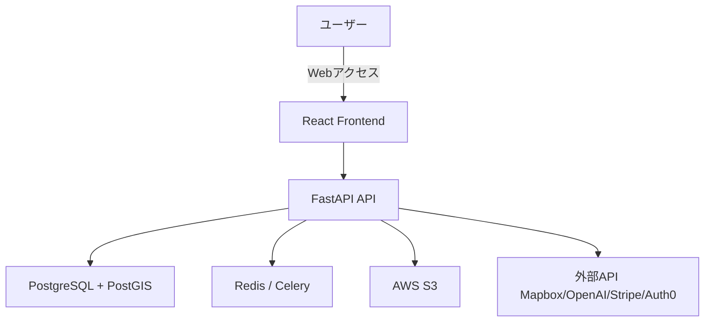

# 要件定義書

## 1. プロジェクト概要

### 1.1 プロジェクト名

- **「Uplogue（アップログ）AI旅行記録プラットフォーム開発プロジェクト」**

### 1.2 背景・目的

- **背景**: 旅行後に写真が大量に残る一方、時系列整理・場所の紐づけ・文章化が面倒で記録が放置される傾向が強い。SNS投稿は作業化し感情や文脈が失われ、個人の旅行体験が価値として蓄積されにくい。
- **目的**: 写真の位置情報・時刻情報から旅行の行程を自動生成し、記録作業を完全自動化する。生成完了率70%以上、30日後継続率50%以上、シェア率20%以上を目標とし、1年以内に10万人ユーザーを獲得する。

### 1.3 システムのビジョン / スコープ

- **ビジョン**: 「あなたの思い出が、誰かの次の旅になる。」を実現する体験記憶プラットフォームとして、個人の旅行ログをライフログ化し、集合知として旅行発見に活用する。
- **スコープ**:
  - 本フェーズ（MVP）: Webアプリで写真アップロード、時系列整列、クラスタリング、タイムライン・地図表示、基本共有までを実装。
  - 将来フェーズ: ネイティブアプリ、旅行発見レコメンド、B2B/B2Gデータ提供、旅行証明APIなどは対象外（将来検討）。

---

## 2. ビジネス要件

### 2.1 ビジネスモデル情報（任意）

- **リーンキャンバスまとめ**:
  - **課題**: 旅行記録が面倒で続かない、SNSでは文脈が残らない、レビュー依存で自分らしい旅が見つからない。
  - **価値提案**: 写真をアップするだけでストーリーと知識に変換し、記録と発見を同時に成立させる。
  - **収益構造**: プレミアム生成サブスク、生成クレジット課金、保存容量拡張、観光事業者向けインサイト提供。
  - **コスト構造**: AI推論コスト、ストレージ、開発人件費、ユーザー獲得費。
- **7Powers視点**:
  - **ネットワーク効果**: 体験データが蓄積されるほど行程推定精度が向上。
  - **スイッチングコスト**: 時系列ログが「人生ログ」となり移行コストが上昇。
  - **プロセス優位**: クラスタリング調整・誤分割修正の運用ノウハウが競争優位を形成。
- **市場規模 / 成長予測**: 初期ユーザー500-1,000人、1年後10万人、3年後50万人（仮定）。

### 2.2 成果指標（KPI/KGI）

- **KPI**:
  - 旅行後生成完了率: 70%以上
  - 月間ストーリー生成数: 10,000件（仮定）
  - シェア率: 20%以上
  - 30日後継続率: 50%以上
  - データ増加速度: 月間旅行記録+10,000件（仮定）
- **KGI**:
  - 1年後: ユーザー数10万人、年間売上1,000万円（仮定）
  - 3年後: B2B/B2G収益比率30%（仮定）

### 2.3 ビジネス上の制約

- **予算**: (要確認)
- **開発期間**: MVP 6ヶ月（仮定）
- **リソース**: 開発チーム構成・スキルは未確定（要確認）
- **法的要件**: GDPR、日本の個人情報保護法、位置情報の取り扱いに関する同意取得が必須。

---

## 3. ユーザー要件

### 3.1 ユーザープロファイル / ペルソナ

- **主要ペルソナ**:
  - 29歳男性、都市部勤務の会社員。旅行が好きで毎回大量の写真を撮るが、帰宅後は忙しく記録が放置されがち。
  - 利用デバイス: スマートフォン（iOS/Android）、PCブラウザ。
- **課題・不満点**:
  - 旅行後の整理が面倒で記録が残らない。
  - SNSでは旅の流れや感情が伝わりにくい。
  - 他人のレビューばかりで自分に合う旅を見つけにくい。

### 3.2 ユーザーストーリー

1. **旅行好き会社員として、旅行後に写真をアップロードするだけで記録を作りたい。なぜなら整理作業に時間を取られたくないからだ。**
2. **カップル旅行者として、旅の流れを一目で共有したい。なぜなら説明不要で思い出を共有したいからだ。**
3. **子育て中の親として、家族旅行の記録を長期的に残したい。なぜなら子どもの成長を後から振り返りたいからだ。**
4. **ライトクリエイターとして、SNS投稿用に整った旅行記を作りたい。なぜなら投稿作成の負担を減らしたいからだ。**
5. **旅行頻度の高いビジネスパーソンとして、複数旅行の履歴を年表で整理したい。なぜなら過去の体験を資産として蓄積したいからだ。**

### 3.3 MVP（Minimum Viable Product）の定義

- **MVPで実装する範囲**:
  - 写真アップロード（複数選択）
  - EXIF抽出、時系列整列、簡易クラスタリング
  - タイムライン表示（スポットカード＋代表写真）
  - 地図プロット（スポットピン表示）
  - ユーザー登録・ログイン
  - URL共有（基本共有）
- **MVPのゴール**:
  - 自動生成価値の検証（生成完了率60%以上）
  - 継続利用意向の検証（「もう一度使いたい」50%以上）
  - シェア率15%以上の達成

---

## 4. 機能要件

### 4.1 機能一覧 / MoSCoW 分類

| 機能 ID | 機能名 | 要約 | Must/Should/Could/Won't | MVP 対象 |
| ------- | ------ | ---- | ----------------------- | -------- |
| F-001 | ユーザー登録 | メール/ソーシャル登録 | Must | Yes |
| F-002 | ログイン | 認証とセッション管理 | Must | Yes |
| F-003 | プロフィール管理 | ユーザー情報編集 | Should | No |
| F-004 | 写真アップロード | 複数写真アップロード/EXIF抽出 | Must | Yes |
| F-005 | 外部写真インポート | Google Photos/iCloud連携 | Should | No |
| F-006 | 旅行自動生成 | 時系列整列/クラスタリング | Must | Yes |
| F-007 | 逆ジオコーディング | 地名・スポット名推定 | Must | Yes |
| F-008 | タイムライン表示 | 時系列カード表示 | Must | Yes |
| F-009 | 地図表示 | スポットピン/ルート | Must | Yes |
| F-010 | AIストーリー生成 | 文章生成/トーン調整 | Should | No |
| F-011 | 共有機能 | URL共有/SNSシェア | Must | Yes |
| F-012 | 年表ビュー | 過去旅行の年表表示 | Could | No |
| F-013 | リマインド通知 | 旅行後の生成促進 | Should | No |
| F-014 | レコメンド | 次の旅の提案 | Could | No |
| F-015 | 管理者機能 | ユーザー管理/モデレーション | Should | No |

### 4.2 機能詳細仕様

#### 4.2.1 `<機能 ID: F-001 ユーザー登録>`

- **概要**: メールアドレスまたはソーシャルログインでアカウントを作成する。
- **ユースケース**: 「初めてサービスを利用するユーザー」
- **前提条件**: 認証サービス（Auth0 など）が導入済み。
- **正常系フロー**:
  1. ユーザーが登録画面を開く
  2. メール/ソーシャルログインを選択
  3. 必要情報を入力し登録
  4. 登録完了後、初回オンボーディング画面へ遷移
- **例外系フロー**:
  - 既に登録済みのメールアドレスの場合はエラーメッセージを表示
  - 入力値が不正の場合（メール形式不正など）
- **UI 要件**:
  - 入力エラーはリアルタイムで表示
  - 登録完了後、写真アップロードへの導線を提示
- **非機能面注意**:
  - TLS通信、パスワードハッシュ化
  - 登録完了まで3秒以内を目標

#### 4.2.2 `<機能 ID: F-004 写真アップロード>`

- **概要**: 複数写真をアップロードし、EXIF情報を抽出する。
- **ユースケース**: 「旅行後に写真をまとめて登録する」
- **前提条件**: 画像ストレージ（S3 等）が利用可能。
- **正常系フロー**:
  1. ユーザーがアップロード画面を開く
  2. 複数写真を選択またはドラッグ&ドロップ
  3. EXIF（GPS/日時）抽出
  4. アップロード完了後、旅行生成処理へ移行
- **例外系フロー**:
  - GPS情報が欠損している場合は警告を表示し、手動位置指定を選択可能
  - 対応外形式の場合はアップロード不可
- **UI 要件**:
  - アップロード進捗バーを表示
  - 失敗時はリトライボタンを表示
- **非機能面注意**:
  - 100枚アップロード60秒以内を目標
  - 画像のウイルススキャン（仮定）

#### 4.2.3 `<機能 ID: F-006 旅行自動生成>`

- **概要**: EXIF情報から時系列整列とクラスタリングを行い旅行記録を生成する。
- **ユースケース**: 「旅行の行程を自動で整理したい」
- **前提条件**: EXIF抽出済みでGPS/時刻データが存在。
- **正常系フロー**:
  1. 写真を撮影日時順にソート
  2. 距離閾値200m・時間閾値30分でクラスタリング
  3. スポット単位で代表写真を選定
  4. 旅行記録を生成しタイムラインに反映
- **例外系フロー**:
  - GPS欠損が多い場合、時刻のみタイムラインへ配置
  - 生成失敗時は再試行（最大3回）
- **UI 要件**:
  - 生成進捗表示、完了通知
- **非機能面注意**:
  - 50枚の旅行生成5分以内

#### 4.2.4 `<機能 ID: F-008 タイムライン表示>`

- **概要**: 旅行行程を時系列カードとして表示する。
- **ユースケース**: 「旅行を振り返りたい」
- **前提条件**: 旅行記録データが生成済み。
- **正常系フロー**:
  1. タイムライン画面を開く
  2. スポットカードを時系列に閲覧
  3. 各カードで写真一覧を確認
- **例外系フロー**:
  - データ取得失敗時は再読込ボタンを提示
- **UI 要件**:
  - スクロール時に滑らかな遷移
  - 地図表示との相互リンク
- **非機能面注意**:
  - 主要画面ロード3秒以内

#### 4.2.5 `<機能 ID: F-011 共有機能>`

- **概要**: URL共有とSNS共有を提供する。
- **ユースケース**: 「旅行の記録を友人に共有したい」
- **前提条件**: 共有対象の旅行記録が存在。
- **正常系フロー**:
  1. 共有ボタンを押下
  2. URL共有またはSNS共有を選択
  3. OGP最適化されたプレビューを生成
- **例外系フロー**:
  - 公開設定が「非公開」の場合は共有不可
- **UI 要件**:
  - SNSごとに最適化テンプレートを表示
- **非機能面注意**:
  - 共有URLのアクセス権管理

---

## 5. 非機能要件

### 5.1 パフォーマンス要件

- **レスポンス時間**: 主要画面3秒以内
- **同時接続数**: 初期1,000ユーザー同時アクセス対応
- **処理量**: 1日10,000リクエスト想定（仮定）

### 5.2 セキュリティ要件

- **認証／認可**: Auth0（仮定）、JWTによるセッション管理
- **データ保護**: HTTPS通信、位置情報はAES-256暗号化
- **監査ログ**: 管理者操作ログ・アクセスログを記録
- **コンプライアンス**: GDPR、日本の個人情報保護法準拠

### 5.3 可用性・信頼性

- **稼働率**: 99.5%以上
- **障害時復旧**: 日次バックアップ、30日保持、復旧手順を整備
- **フェイルオーバー**: マルチリージョンは将来検討（仮定）

### 5.4 ユーザビリティ / UI・UX

- **アクセシビリティ**: WCAG 2.1 AA準拠
- **多言語対応**: 日本語のみ（初期）、英語は将来検討
- **操作導線**: 3ステップ以内でアップロード完了

### 5.5 スケーラビリティ

- **水平/垂直スケーリング**: AWS ECS Fargateで自動スケール
- **突発的アクセス増対策**: CDN、キャッシュ、非同期処理キュー

---

## 6. インテグレーション要件

### 6.1 外部サービス / SaaS 連携

- **認証系**: Auth0（仮定）
- **データベース**: PostgreSQL + PostGIS
- **決済系**: Stripe
- **ストレージ**: AWS S3
- **AI・ML**: OpenAI API / Claude
- **外部写真連携**: Google Photos / iCloud / Dropbox（中期）
- **地図/ジオコーディング**: Mapbox

### 6.2 API 仕様

- **提供・利用 API**: REST（仮定）
- **エンドポイント例**:
  - `POST /api/auth/register`
  - `POST /api/photos/upload`
  - `POST /api/trips/generate`
  - `GET /api/trips/{id}`
- **フォーマット**: JSON
- **API仕様詳細**: (要検討)

### 6.3 データ連携要件

- **データ形式**: JSON、画像はバイナリ
- **頻度**: リアルタイム（アップロード時）＋バッチ（生成処理）
- **再送制御**: 失敗時の自動リトライ（最大3回）

---

## 7. 技術選定とアーキテクチャ

### 7.1 技術スタックの要約

- **フロントエンド**: React 18 + TypeScript + Tailwind CSS
- **バックエンド**: Python 3.11 + FastAPI + Celery
- **データベース**: PostgreSQL 15 + PostGIS
- **認証**: Auth0（仮定）
- **ホスティング / デプロイ**: AWS ECS Fargate / RDS / S3
- **AI**: OpenAI API / Claude

### 7.2 アーキテクチャ概要

- **UI層**: React Webアプリ
- **API層**: FastAPI（REST）
- **非同期処理**: Celery + Redis
- **DB層**: PostgreSQL + PostGIS
- **外部連携**: Mapbox、OpenAI、Stripe、Auth0

### 7.3 システム構成図 (簡易例)

---

## 8. 開発プロセス / スケジュール

### 8.1 開発モデル・プロセス

- **アジャイル / イテレーティブ**: MVP → フィードバック → 改善

### 8.2 スケジュール例

| フェーズ | 期間 | 主なタスク |
| -------- | ---- | -------- |
| 要件定義 | 1ヶ月（仮定） | ユーザーストーリー作成、機能リスト確定 |
| デザイン | 1ヶ月（仮定） | UI/UX設計、プロトタイプ作成 |
| 実装（MVP） | 4ヶ月（仮定） | フロント/バックエンド実装、SaaS連携 |
| テスト | 1ヶ月（仮定） | 機能テスト、UIテスト、負荷テスト |
| リリース＆検証 | 1ヶ月（仮定） | ユーザー検証、改善要望収集 |

---

## 9. リスクと課題

### 9.1 リスク一覧

| No | リスク内容 | 影響度 | 発生確率 | 対応策 |
| --- | --- | --- | --- | --- |
| R1 | 位置情報欠損で行程生成精度が低下 | 高 | 中 | 手動位置指定、補完アルゴリズム |
| R2 | AI APIコスト増大 | 中 | 高 | 生成回数制限、オープンソースLLM検討 |
| R3 | 継続利用率が伸びない | 高 | 中 | リマインド通知、年次振り返り |
| R4 | プライバシー規制対応不足 | 高 | 低 | 明示的同意、法務レビュー |
| R5 | 競合（大手）参入 | 中 | 中 | 旅行特化UX、データネットワーク効果 |

### 9.2 課題 / 前提条件

- 開発予算とチーム体制が未確定（要確認）
- 外部APIのレート制限・コストの管理が必要
- 旅行検知アルゴリズムの精度検証が必要

---

## 10. ランニング費用と運用方針

### 10.1 ランニング費用の目安

- **クラウド（AWS）**: 月$200〜$500（初期1,000ユーザー規模、仮定）
- **AI API**: 旅行1件あたり¥50〜100（仮定）
- **ストレージ**: S3利用量に応じた従量課金
- **モニタリング**: CloudWatch / Datadog 月$50〜$200（仮定）

### 10.2 運用・保守体制

- **運用チーム**: 1〜2名（仮定）
- **監視ツール**: CloudWatch / Datadog
- **アップデート頻度**: 月1回リリース（仮定）
- **インシデント対応**: 重大障害時は24時間以内に一次対応（仮定）

---

## 11. 変更管理

- 要件変更はプロダクトオーナーが承認するプロセスを採用（仮定）
- GitHub Issue / Pull Request による履歴管理
- 変更履歴は要件定義書にバージョン記録を追加

---

## 12. 参考資料 / 関連ドキュメント

- `docs/output/system_requirements.md`
- `docs/input/uplogue_lean_canvas_concise.md`
- `docs/input/uplogue_7powers_moat_analysis.md`
- `docs/input/uplogue_value_proposition_canvas.md`
- `docs/input/uplogue_customer_journey.md`
- `docs/input/uplogue_pricing_strategies.md`
- `docs/input/uplogue_innovative_business_models.md`
- `docs/input/uplogue_auto_triplog_location_time_only.md`
- `docs/input/uplogue_design_style_guide.md`
